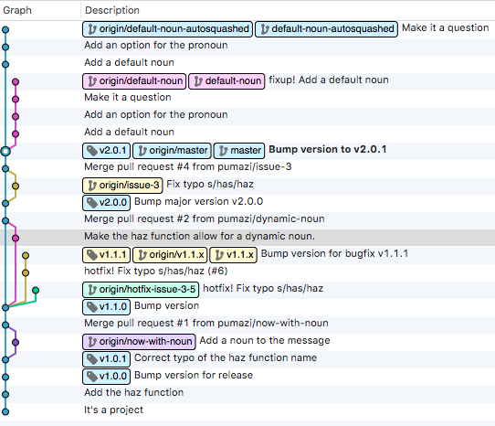

# Example of Open Source GitFlow

This is a response to a Community of Practice (COP) topic discussion on using GitFlow and versioning.

Historical and contemporary versioning and releasing of software in Open Source follows a few simple guidelines. One, there is usually a release manager (RM) that vets the inclusion of features. In the absense of an RM or to augment the RM, a team of individuals vets and discusses inclusion of features. But usually only one person is making releases, the RM.

The definition of 'release' depends on the project. For Java based applications, this might be a compiled jar file. For Python, this could be a distribution tarball (or equivalent zip format) or wheel. For Ruby, this could be a Gem. And so forth. It usually means that there is an artifact that is a snapshot of the project at the time of the release.

The second element of Open Source guidelines is that you can't force your users to use the latest version. Because of this, you must support more than one version. This does not mean you backport features to previous versions, it only means that you are responsive to bug fixes. The RM is responsible for merging bug fixes and as a result tagging and releasing a new version.

These Open Source practices can be observed in the following projects, to name but a few: Python, Plone, Zope and Postgres (and Ansible, to a lesser degree). Many of the same observed practices in these large projects have successfully been put into action by myself and prior colleagues on notable, yet smaller, projects that were used internally and externally among several organizations. One of the powerful elements of this practice is that it tends to scale from a one developer project to a several thousand developer project without changing the overall way the project has been managed just because of a flux in the user/developer base.

## A word on versioning

Versioning is a core principal of software. Without it we would have a very difficult time comparing the results of the seemingly same product. Can you imagine if your programming language were not versioned? How would anyone be able to discuss differences between changes in the language? The same principals are necessary for the software applications we build.

It's understandable to at first think, "Why should we version our software if we are the only ones using it?" It's a completely valid question. The cursory response to this is, "Don't reinvent the wheel." But really it's not about reinventing the way software is versioned and distributed. It is about being able to scale the solution from, it's just me using it to the entire world is using it. Plus, as illustrated earlier, the open source community uses versions as does most software; so fitting into that practice means you don't have to reinvent your own or remember the special practice that your project uses.

## A word on communicating change

Being about to communicate about a revision is particularly important because we are human. Say I encounter a bug in a deployment of Varnish 3. I report the bug to the mailing list. The first question will be, "What version are you running?" And this is important because we are working with Varnish 3, when Varnish 5 was just released. Versions provide a way to communicate a specific revision in time as well as contextualize which changes we want to talk about.

We have the powerful vocabulary to concisely communicate the degree of change using something called semantic versioning. Incrementation is understood to mean change (e.g. 2016 to 2017, sprint 6.17 to 6.18). Semantic versioning builds upon incremental numbering using a three digit system `X.Y.Z`. One can communicate a major change by incrementing `X`, which might be an API change or major feature set. The `Y` change typical communicates that a feature has been added or remove and/or bug fixes have been made. Lastly, The `Z` communicates bug fixes that correct existing features of the product. Thus, in a short sequence of numbers we can talk communicate the degree of change without actually talking about the change itself.

Others could be using a revision different from what you are using. It is unusual in a single site focused shop that there is more than one revision of the software out there at a time, but one thing this document hopefully illustrates is the practice shown here scales from a single environment to many without changing the workflow.

## An example

How this works in practice... The example that follows is a simple Python distribution that contains a single module: `icanhaz.py`. What is shown here is that there are two major versions of the software in play at the time. We will work on both versions and make releases for both.

Surf over to https://github.com/pumazi/icanhaz to flow along.

The project starts off as master with a few commits to the project. We make an [initial major release](https://github.com/pumazi/icanhaz/releases/tag/v1.0.0) `v1.0.0`, a [bug release](https://github.com/pumazi/icanhaz/releases/tag/v1.0.1) as `v1.0.1` and a [minor release](https://github.com/pumazi/icanhaz/releases/tag/v1.1.0) shortly after that as `v1.1.0`. The minor release here adds a feature, but does not change the behavior of the application or the application's API. (See also semantic versioning for details about why.)

We then start development on feature that allows for user input, which will change the application's behavior and API. After the [feature is merged](https://github.com/pumazi/icanhaz/pull/1) we [release](https://github.com/pumazi/icanhaz/releases/tag/v2.0.0) the application as `v2.0.0`. Yay!

By this point, people are using the tool and finding bugs. One of our users [found a bug](https://github.com/pumazi/icanhaz/issues/3) in the version they are using, `v1.1.0`. Keep in mind that `v2.0.0` has been released. However, this user can't upgrade yet. (Don't ask why. ;D )

We [fix the bug](https://github.com/pumazi/icanhaz/issues/3) on master. But again, this user can't upgrade to `v2.x.x` yet. Now we need to [release a hotfix](https://github.com/pumazi/icanhaz/issues/5). We do this by creating a branch off the tag `v1.1.0` as `v1.1.x` (i.e. `git checkout -b v1.1.x v1.1.0`). We cherry-pick over the bug fix, if possible, and create a [pull request](https://github.com/pumazi/icanhaz/pull/6). After the merge, we tag and [release](https://github.com/pumazi/icanhaz/releases/tag/v1.1.1) `v1.1.1`. And now we have the `v1.1.x` branch to commit additional hotfixes to. When we have stopped supporting the first version of our application, this branch will be deleted.

Meanwhile, [development on master continues](https://github.com/pumazi/icanhaz/pull/7) for `v2.x.x` versions. (The icanhaz repo has been left in this final state to illustrate how features go in.)

One thing that's not visible in this example is the release process. It's noted here that releases are made, but not how. (And since this is a fake project, I didn't actually make the releases.) Our [Tagging and Release Workflow](https://github.com/Connexions/devops/wiki/Tagging-and-Release-Workflow) has been out on the web for a while now. For a better illustration of an actually released bit of our work, see the [pyramid_sawing project repo](https://github.com/Connexions/pyramid_sawing) and [pyramid_sawing PyPI entry](https://pypi.python.org/pypi/pyramid_sawing).
