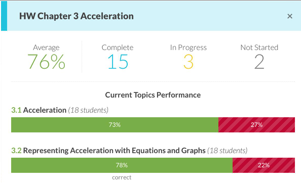

# Stat Caching & Publish / Subscribe in tutor-server

## Problem Scenario

When teachers click on assignments in their calendar, we display "quick look analytics":



These are statistics about the performance of their class on the clicked assignment.  Currently, these stats are compiled anew on each viewing -- we gather all of the tasks and exercises associated with the assignment's plan, then group and count them in various ways.  When certain statistics are below a threshold, we display trouble flags on the stats UI.  It is relatively slow.

There is an outstanding ask to show the trouble flags directly on the calendar entries when the teacher views their dashboard.  In the current implementation, this means that we'd need to calculate the plan stats for all plans in an entire course whenever someone hits the dashboard endpoint -- we'd need all the stats so we could tell which plans are showing the trouble flag.  Given that the computation from scratch of one quick look analytics' stats is relatively slow, computing from scratch all stats in a course (e.g. 80 plans) would be prohibitively slow.

## Potential Solution

The main problem is that we're recomputing everything from scratch all of the time.  To stop doing this, we need to start caching the statistics and only update them when the underlying data changes.

For the top part of the quick look analytics, the caching class may look like:

```ruby
class Tasks::Models::TaskPlanStats
  belongs_to :task_plan
  belongs_to :period

  def refresh!
    tasks = Tasks::Models::Task
      .joins{tasking}
      .where{tasking.course_membership_period_id == course_membership_period_id}
      .where{tasks_task_plan_id == my{tasks_task_plan_id}}
      .all

    completed_tasks = tasks.select(&:completed?)

    self.mean_grade_percent = percent(avg(completed_tasks.collect(&:fraction_correct)))
    self.completed_task_count = completed_tasks.size
    self.in_progress_task_count = tasks.count(&:in_progress?)
    self.task_count = tasks.size

    save!
  end

  def avg(array = [])
    array = array.compact
    array.empty? ? nil : array.inject(:+) / array.size
  end

  def percent(fraction)
    fraction.nil? ? nil : (100.0 * fraction).round
  end
end
```

When `refresh!` is called, the stats object gathers the relevant tasks and stores some statistics on them.  These stats can then be read out efficiently to produce the top half of the quick look analytics.

Similarly, for the page-level stats (the bottom part of the quick look analytics), we can have something like:

```ruby
class Tasks::Models::TaskPlanPageStats
  belongs_to :task_plan
  belongs_to :page
  belongs_to :period

  def refresh!
    # Find all completed TaskedExercises in this plan, page, and period
    tasked_exercises = Tasks::Models::TaskedExercise
      .joins{task_step.task.tasking}
      .joins{exercise}
      .where{task_step.task.tasking.course_membership_period_id == course_membership_period_id}
      .where{task_step.task.tasks_task_plan_id == tasks_task_plan_id}
      .where{exercise.content_page_id == content_page_id}
      .where{task_step.first_completed_at != nil} # squeel sifter here? (http://goo.gl/5vVUP)
      .preload({task_step: :task})
      .all

    self.started_students_count =
      tasked_exercises.collect{|te| te.task_step.task.tasks_tasking_id}.uniq.count

    self.completed_count = tasked_exercises.size
    self.correct_count = tasked_exercises.count(&:is_correct?)

    incorrect_count = completed_count - correct_count
    all_exercises_count = # ...

    self.trouble = (incorrect_count > correct_count) && (completed_count > 0.25 * all_exercise_count)

    save!
  end
end
```

Ok so this is cool, now we have cached stats that we can refresh on demand.  But there are two problems to overcome:

1. Who instantiates these stats objects and when?
2. How do we trigger the `refresh!` method?

Let's take a shot at the first issue first.

### Instantiating the Stats Records

These stats objects are only used to display data in the UI.  There's currently no reason for them to exist before an end user asks to see the data by clicking on a calendar item.  So let's create them lazily.

When the dashboard endpoint is called, it gathers all of the courses `TaskPlan`s.  We can first create the stats objects when the dashboard endpoint looks for the stats associated with each plan, find-or-create-style.

When the stats objects are created, we'll have to call a `refresh!` to initialize their data for the first time.  For the very first time someone loads their dashboard, this may make the wait too long so we may decide that we want to create these stats objects earlier, like when the plan is published.

Now let's look at triggering the refresh dynamically as data changes.

### Triggering Stat Refresh

We could have a cron job that refreshes the stats every couple of minutes.  But that seems like a lot of wasted work.  Most of the time, of all the task plans in Tutor, only a few will be out of date.  It'd be better to only update those out of date / stale ones.

We currently have a triggering mechanism for doing various things when a `TaskedExercise` is completed, which is the call to [`TaskedExercise#handle_task_step_completion!`](https://goo.gl/54PJU4).

As the first comment in that method indicates, this is not a good method.  This method makes `TaskedExercise` aware of way more than it should be -- it should have no idea about Exchange API calls and Exchange identifiers.  While we could add more outside knowledge to this method to have it find the relevant stats objects and have them refresh, that would just dig our unencapsulated hole even deeper -- I want us to find ways to get out of this method doing anything outside of the scope of the `TaskedExercise` class.

It'd be *much* better to flip the dependencies -- instead of `TaskedExericse` knowing about Exchange and the stats objects, it'd be better for `TaskedExercise` to just say "hey someone just completed me" and then have interested parties hear that and take action.  I.e. a publisher / subscriber approach.

###

Here's a way to record that one object is subscribing to events on another, and to let the publisher notify those subscribers that the event occurred:

```ruby
# In app/subsystems/pub_sub

class PubSub::Models::PublisherSubscriber < ActiveRecord::Base
  validates :publisher_gid, presence: true
  validates :subscriber_gid, presence: true
  # also has an `event` column used to say which events the subscriber
  #   is interested in.

  # validate uniqueness of publisher_gid / subscriber_gid / event tuple?

  def publisher
    GlobalID::Locator.locate publisher_gid
  end

  def subscriber
    GlobalID::Locator.locate subscriber_gid
  end
end

module PubSub::Publisher
  ...
  def publish(event, *args, &block)
    subscribers = PubSub::Models::PublisherSubscriber
                    .where{publisher_gid == self.to_global_id.to_s}
                    .where{event == my{event.to_s}} # or handle nil event
                    .collect(&:subscriber)

    subscribers.each do |subscriber|
      subscriber.send("pub_sub_#{event}", *args, &block)
    end
  end
  ...
end
```

```ruby
# TaskedExercise

include PubSub::Publisher

def handle_task_step_completion!
  publish(:tasked_exercise_completed, self)
  # this should also work for Exchange subscribers in addition to Stats
end
```

So now all that's left is to

1. Make the Stats objects subscribers to TaskedExercise and Task
2. Modify the Stats objects to respond to events from TaskedExercise and Task

We said previously that we'd create the Stats objects on an as-needed basis.  I'm not a big fan of ActiveRecord life cycle callbacks, but pseudocode ease let's for the moment assume we can use them (could instead be in a CreateTaskPlanStats routine)

```ruby
class Tasks::Models::TaskPlanStats

  include PubSub::Subscriber
  after_create :setup_subscriptions

  ...

  def setup_subscriptions
    # The plan could already have tasks, so call the event handler
    # method on all of them, then subscribe to the event where a plan
    # adds a new task so that we can handle future task events too
    @task_plan.tasks.each do |task|
      pub_sub_add_task(task)
    end
    subscribe(@task_plan, :add_task)
  end

  # this is called when the plan publishes (broadcasts) the :add_task event
  # doesn't have to use this pub_sub_ naming convention, but seems good to
  # have some prefix to separate it from normal business logic methods
  def pub_sub_add_task(task)
    subscribe(task, :task_started)
    subscribe(task, :task_completed)
    refresh! # effectively increments the `task_count` field
  end

  def pub_sub_task_started(task)
    refresh!
    # or could reduce work and just increment in_progress_task_count by 1
  end

  def pub_sub_task_completed(task)
    refresh!
  end
end
```

There are lots of ways to organize the subscription stuff inside the TaskPlanStats class.  You could probably put the pub_sub_ methods on an inner class to isolate them from the other business logic, etc.

`TaskPlanPageStats` instances would likely be setup by `TaskPlanStats` when it is created, following a similar pattern to the above.  Instead of subscribing to tasks, `TaskPlanPageStats` objects would subscribe to the task's exercises.

```ruby
class Tasks::Models::TaskPlanPageStats
  ...
  def pub_sub_exercise_completed(tasked_exercise)
    refresh!
    # alternatively, could set a `stale` flag here and a cron job could find
    # stale stats every 10 minutes and call refresh on them.  By doing this
    # we could save a lot of unnecessary refreshes when kids are doing HW
    # but teachers aren't looking at quick looks.
  end
  ...
end
```

The same PubSub approach works for the unecapsulated Exchange calls now in `handle_task_step_completion!`.  If we made one Exchange subscriber for each student or user (that stored that user's exchange write identifier), we could make it a subscriber for each `TaskedExercise` assigned to the user.  This subscriber would then make the Exchange calls in `handle_task_step_completion!`, optionally in a background job.

### PubSub / Event / Messaging Gems

There are a number of pubsub gems out there.  We may get benefit out of using them or we may not.  Wisper doesn't seem to have any persistence ability, which is not great.  MessageBus might be interesting (uses Redis).

1. [Wisper](https://github.com/krisleech/wisper)
2. [Faye](https://github.com/faye/faye)
3. [MessageBus](https://github.com/SamSaffron/message_bus)

