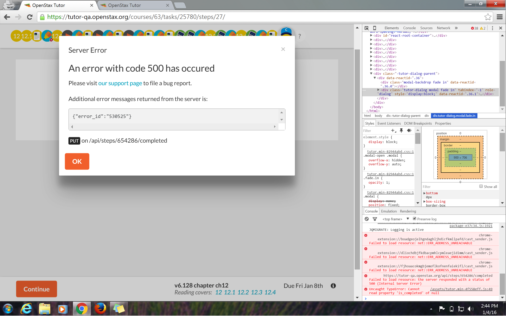

It seems that
`Tutor` is calling `BigLearn` 
to populate the personalized exercises (PEs)
after the core exercises (CEs)
in a Reading assignment are completed.
This call is failing.  (How often?)

Here is a screenshot of the issue that I got from Kajal:


Here is an edited stack trace from `BigLearn`
(the full trace and more can be seen
[here](https://gist.github.com/pumazi/4caaed3e1d8f08084a81),
which was acquired by Michael M. using some nifty python tricks):
```
<snip>
  File "biglearn/api/endpoints/projections.py", line 87, in next_questions
    include_spy_values)
  File "biglearn/api/endpoints/projections.py", line 167, in _compute_next_questions
    config)
  File "/var/src/biglearn-0.2.0/venv/local/lib/python2.7/site-packages/biglearn/algorithms/tesr/etesr.py", line 104, in adaptive_question_recommendation
    cmatrix = sparfac(ymatrix, wmatrix, cmatrix, conf.sparfac_config)
  File "/var/src/biglearn-0.2.0/venv/local/lib/python2.7/site-packages/biglearn/algorithms/sparfa/tag/minic_box.py", line 201, in sparfac_with_matrices
    w = question_topics[ind, :]
IndexError: invalid index into a 0-size array
```

The following is an annotated summary of the [code](https://github.com/openstax/biglearn-algs/blob/master/biglearn/algorithms/sparfa/tag/minic_box.py#L201)
causing the error:
```python
def sparfac_with_matrices(responses, question_topics, mastery, config=None):
    ## p len(responses)         #=> 42
    ## p question_topics.shape  #=> (0, 1)
    ## p mastery.shape          #=> (0, 1)
    ...
    for nn in range(0, N): ## p N   #=> 1
        ## p nn   #=> 0
        responses_local = responses[:, nn: nn + 1]  ## p responses_local.shape  #=> (42, 1)
        ind = np.where(responses_local >= 0)[0]     ## p ind.shape              #=> (42,)
        ...
        w = question_topics[ind, :]  ## KA-BOOM!
        ...

    return C
```

So we can see
that this function is doomed to fail
because it's being fed empty W (`question_topics`) and C (`mastery`) matrices.

The moving back up the stack trace to
[etesr.py](https://github.com/openstax/biglearn-algs/blob/master/biglearn/algorithms/tesr/etesr.py#L104)
shows:
```python
def adaptive_question_recommendation(question_tag_scores,
                                     question_difficulties,
                                     clues,
                                     responses,
                                     number_of_questions=1,
                                     target_success_probability=0.5,
                                     config=None):
    ## p question_tag_scores   #=> []
    ## p question_difficulties #=> []
    ## p clues                 #=> []
    ## p len(responses)        #=> 42
    ...
    if responses:
        ymatrix, tmatrix, _, learners = assemble_ymatrix_and_tmatrix(
            responses, questions)
    else:
        ymatrix = np.full((len(questions), 1), np.nan)
        tmatrix = np.full((len(questions), 1), None)
        learners = [None]

    if clues:
        cmatrix, _, _ = assemble_cmatrix(clues, tags, learners)
    else:
        cmatrix = np.zeros((len(tags), 1))

    conf = get_conf(tesr_defaults, config)
    ## p conf.update_clues  #=> True
    if conf.update_clues and responses:
        from biglearn.algorithms.sparfa.tag.minic_box import \
            sparfac_with_matrices as sparfac
        cmatrix = sparfac(ymatrix, wmatrix, cmatrix, conf.sparfac_config)  ## KA-BOOM!
    ...
    return result
```
Again it seems that the caller is dooming this function to failure.

Moving up the stack to
[projections.py](https://github.com/openstax/biglearn-platform/blob/master/app/biglearn/api/endpoints/projections.py#L161-L167):
```python
def _compute_next_questions(learner_id,
                            question_ids,
                            number_of_questions,
                            target_success_probability=0.5,
                            allow_repetition=True,
                            include_spy_values=False):
    ## p len(question_ids)    #=> 48  <-- number of questions in pool (not 42)
    ## p number_of_questions  #=> 1   <-- how many we want, not how many we have above
    ...
    # Get question tag scores from knowledge store
    question_tag_scores = knowledge.get_w_matrix_for_questions(question_ids)
    ## p question_tag_scores  #=> []  <-- problem 1!

    # Get the Y matrix from realtime and facts for this learner
    responses = response.get_responses_for_learner(learner_id)
    ## p len(responses)  #=> 42  <-- number of student respones (not 48)
    ...
    # Get difficulties from knowledge store
    difficulties = knowledge.get_mu(question_ids)
    ## p difficulties  #=> []  <-- problem 2!

    # Get clues from knowledge store
    tag_ids = sorted(set((t for _, t, _ in question_tag_scores)))
    clues = knowledge.get_c_matrix(learner_id, tag_ids)
    ## p clues  #=> [] <-- looks fishy, but handled inside adaptive_question_recommendation
    ...
    result = adaptive_question_recommendation(question_tag_scores,
                                              difficulties,
                                              clues,
                                              responses,
                                              number_of_questions,
                                              target_success_probability,
                                              config) ## KA-BOOM!
    ...
    return results
```

So the `knowledge` store doesn't know about W and mu data for these questions.
Looking in
[db/knowledge/model.py](https://github.com/openstax/biglearn-platform/blob/master/app/biglearn/db/knowledge/model.py#L193-L228)
shows it hitting the database and coming up empty.

Where do these values get set?
Adding new values happens
[here](https://github.com/openstax/biglearn-platform/blob/master/app/biglearn/db/knowledge/model.py#L442-L470),
and resetting the whole table happens
[here](https://github.com/openstax/biglearn-platform/blob/master/app/biglearn/db/knowledge/model.py#L305-L328).

Scanning all four `BigLearn` repos shows that updates only happen in
[sparfa_tag](https://github.com/openstax/biglearn-platform/blob/master/app/biglearn/jobs/workflows/algorithms.py#L15),
which suggests this problem should disappear 
after the first run of `sparfa_tag`
after an ecosystem is assigned to a course
(right? maybe? hopefully the questions don't actually need to be answered to work...).

By poking around in the database,
I've established that
`BigLearn` knows about all the questions in the pool,
but doesn't know about any topics (LOs) associated with those questions:
```
>>> pdb.set_trace()
--Return--
> <stdin>(1)<module>()->None
(Pdb) b biglearn/db/knowledge/model.py:213
Breakpoint 7 at /var/src/biglearn-0.2.0/biglearn/db/knowledge/model.py:213
(Pdb) c
>>> client.get(uri_bad)
> /var/src/biglearn-0.2.0/biglearn/db/knowledge/model.py(213)get_w_matrix_for_questions()
-> stmt = db.select([qmatrix.c.id,
(Pdb) question_list
[(u'//exercises-qa.openstax.org/exercises/7003', 1), (u'//exercises-qa.openstax.org/exercises/7004', 1), (u'//exercises-qa.openstax.org/exercises/7005', 1), (u'//exercises-qa.openstax.org/exercises/7006', 1),
...
(u'//exercises-qa.openstax.org/exercises/7153', 1), (u'//exercises-qa.openstax.org/exercises/7154', 1), (u'//exercises-qa.openstax.org/exercises/7155', 1), (u'//exercises-qa.openstax.org/exercises/7156', 1)]
(Pdb) ks_qmatrix_ids = db.select([qmatrix.c.id]).select_from(qmatrix).where(qmatrix.c.question_id.in_(question_id_list))
(Pdb) kr_qmatrix_ids = conn.execute(ks_qmatrix_ids).fetchall()
(Pdb) kr_qmatrix_ids
[(5879,), (5882,), (5883,), (5894,), (5895,), (5896,), (5949,), (6096,), (6097,), (6100,), (6106,), (6114,), (6127,), (6378,), (6384,), (6428,), (6429,), (6507,), (6508,), (6510,), (6511,), (6512,), (6513,), (6514,), (6515,), (6516,), (6567,), (6568,), (6569,), (6570,), (6571,), (6572,), (6573,), (6574,), (6605,), (6606,), (6607,), (6608,), (6610,), (6611,), (6612,), (6613,), (6708,), (6709,), (6827,), (6950,), (6951,), (6952,)]
(Pdb) len(kr_qmatrix_ids)
48
(Pdb) qmatrix_ids = [x[0] for x in kr_qmatrix_ids]
(Pdb) qmatrix_ids
[5879, 5882, 5883, 5894, 5895, 5896, 5949, 6096, 6097, 6100, 6106, 6114, 6127, 6378, 6384, 6428, 6429, 6507, 6508, 6510, 6511, 6512, 6513, 6514, 6515, 6516, 6567, 6568, 6569, 6570, 6571, 6572, 6573, 6574, 6605, 6606, 6607, 6608, 6610, 6611, 6612, 6613, 6708, 6709, 6827, 6950, 6951, 6952]
(Pdb) ks_wmatrix_ids = db.select([wmatrix.c.id]).select_from(wmatrix).where(wmatrix.c.question_id.in_(qmatrix_ids))
(Pdb) kr_wmatrix_ids = conn.execute(ks_wmatrix_ids).fetchall()
(Pdb) kr_wmatrix_ids
[]
(Pdb) ks_wmatrix_ids = db.select([wmatrix.c.id]).select_from(wmatrix)
(Pdb) kr_wmatrix_ids = conn.execute(ks_wmatrix_ids).fetchone()
(Pdb) kr_wmatrix_ids
(81047761,)
(Pdb) ks_wmatrix_ids = db.select([wmatrix.c.id, wmatrix.c.question_id, wmatrix.c.tag_id]).select_from(wmatrix)
(Pdb) kr_wmatrix_ids = conn.execute(ks_wmatrix_ids).fetchone()
(Pdb) kr_wmatrix_ids
(81047761, 2831, u'apbio-ch19-s03-aplo-1-5')
```

All of this, plus the `BigLearnFlower` admin API,
points the `BigLearn` worker threads being hosed.

After resetting them
(thanks Chris!)
and running a "full refresh",
it seems that `BigLearn`
is now populating the W and C matrix data.

There a some minor errors in the `PaperTrail` logs,
but I believe those existed previously.

#### Root Cause

It turns out that 
the permissions on the `qmatrix` postgres table 
were set incorrectly, akin to
[this](http://stackoverflow.com/questions/15520361/permission-denied-for-relation)
StackOverflow issue.

Chris adjusted the permissions for the tables
on each of the existing environments,
and it seems that `BigLearn` is working again.
The ansible scripts will be updated
to prevent this from re-occurring in the future
when/if new environments are created.
